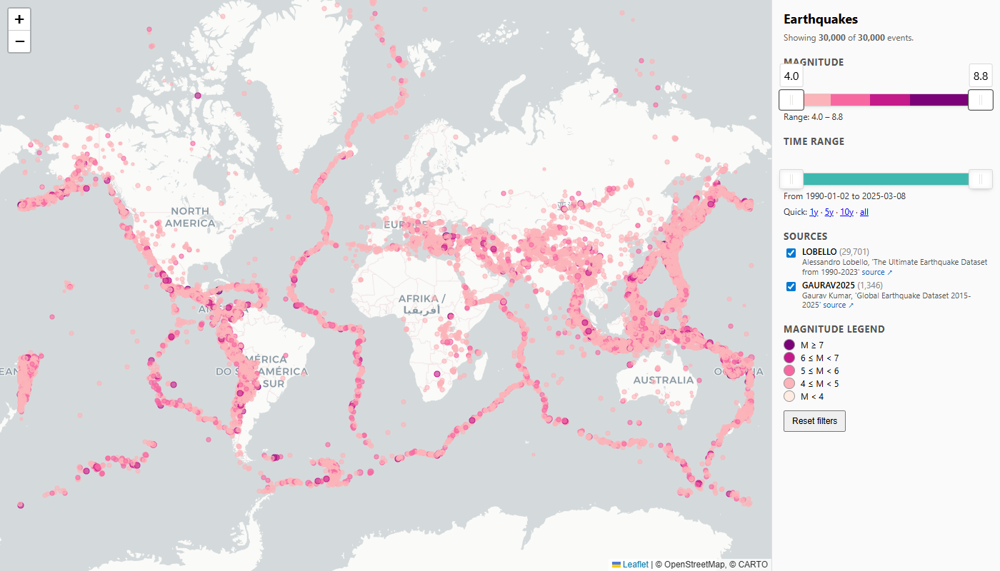
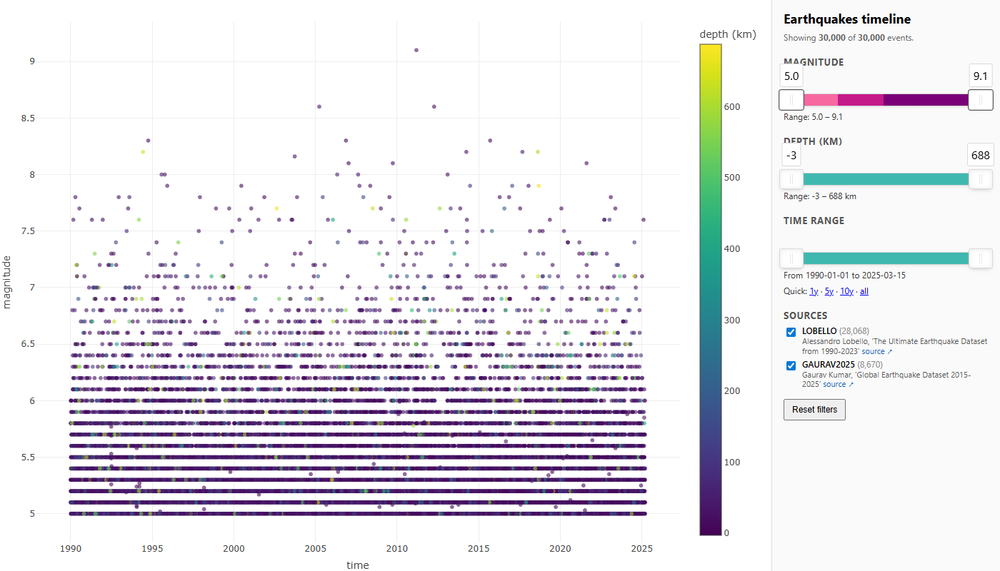

# Earthquakes

Explore Kaggle earthquake datasets, visualize earthquakes on an interactive
map + timeline, and run a baseline "next earthquake" prediction.

> Documentation-first project. Start with [docs/START_HERE.md](docs/START_HERE.md).

## Data sources

Each row in the loaded DataFrame carries a `source` column tagging its
origin. When the same event appears in more than one source, the codes are
joined with commas (e.g. `LOBELLO,GAURAV2025`).

| Label | Source | Range | Citation |
|------|--------|-------|----------|
| `LOBELLO` | Kaggle | 1990–2023 | Alessandro Lobello, *The Ultimate Earthquake Dataset from 1990-2023*. <https://www.kaggle.com/datasets/alessandrolobello/the-ultimate-earthquake-dataset-from-1990-2023> |
| `GAURAV2025` | Kaggle | 2015–2025 | Gaurav Kumar, *Global Earthquake Dataset 2015-2025*. <https://www.kaggle.com/datasets/gauravkumar2525/global-earthquake-dataset-2015-2025> |
| `NOAA_SIG` | NOAA NCEI/WDS Hazel API | 2150 BC–present | NOAA NCEI/WDS, *Global Significant Earthquake Database*. <https://www.ngdc.noaa.gov/hazel/view/hazards/earthquake/search> |

## Setup (Windows / PowerShell)

```powershell
python -m venv .venv
.\.venv\Scripts\Activate.ps1
pip install -r requirements.txt
```

## Usage

```powershell
# 1. Inspect the dataset (downloads + caches on first run)
python -m earthquakes.cli info

# 2. Build interactive HTML map + timeline -> outputs/
python -m earthquakes.cli viz
```

Outputs land in `outputs/`:
- `map.html` — self-contained Leaflet map with magnitude-scaled markers and a
  right-side filter panel (magnitude range slider, time range slider with
  1y/5y/10y/all quick-windows, per-source checkboxes, magnitude legend, reset
  button)
- `timeline.html` — plotly magnitude-over-time chart

### Screenshots

The bundled `*-sample.html` files were produced with:

```powershell
python -m earthquakes.cli viz --no-cluster --sample --min-magnitude 4.5
```

Interactive map ([`outputs/map-sample.html`](outputs/map-sample.html)) — one marker per earthquake, colour
scaled by magnitude band, with live filtering on magnitude range, time range,
and source:



Magnitude-over-time scatter ([`outputs/timeline-sample.html`](outputs/timeline-sample.html)) — colour = depth (km):



## Prediction

```powershell
# 3. Train baseline forecasting model and print metrics
python -m earthquakes.cli predict

# 4. Restrict training data through one month and choose sources explicitly
python -m earthquakes.cli predict --max 202401 --sources LOBELLO,GAURAV2025
```

`predict` reports the GBM holdout MAE alongside three naive baselines and uses
lag, rolling, trend, and seasonal features derived from monthly cell histories.

Current status: this prediction path was a useful exploratory try, but it has
not yet been successful on the merged Kaggle sources. In direct one-month
backtests, the GBM still loses to simple baselines on overall MAE and tends to
overpredict total activity.

See [docs/design/prediction.md](docs/design/prediction.md) for the current
prediction implementation, features, one-month backtests, limitations, and
next-step ideas.

## Project layout
```
.github/copilot-instructions.md
docs/                # source of truth (read first)
src/earthquakes/     # implementation
data/                # cached parquet (gitignored)
outputs/             # generated HTML (gitignored)
```
